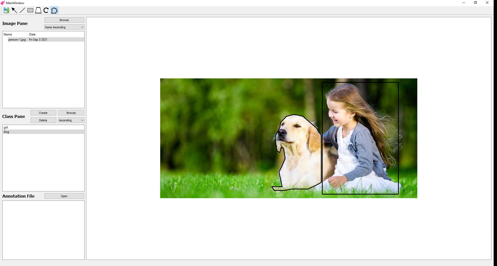

# Project Description
+ This is an image labelling application which generates dataset in the form of JSON to be used by Convolutional
Neural Networks (CNN). The application is built by 4 students including myself in our second year of university.
+ To view the source code for this application refer to this repo: https://github.com/iam-milad/ImageLabellingSourceCode

## How to use the application?
1. Open an image in the 'image pane' and double click on it.
2. Create an empty file with '.names' extension somewhere on your computer.
3. Open that file into the 'classes pane' and create classes that relates to objects in the image.
4. Choose an appropiate shape from the toolbar and start annotating objects in the image.
5. Once done, click the save icon on the toolbar and save the data on your computer.

If later at any point you wanted to edit the annotation file, you can do so by opening the image that was previously annotated along with the respective JSON annotation file. Make sure to double click on the image and the JSON annotation file once opened from the folder.

# Technologies Used
+ C++
+ Qt

# Setup
To run the application double click on the ImageLabel.exe file
